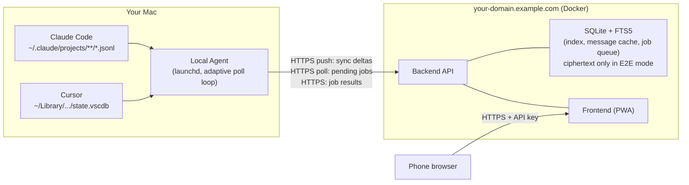

# AI Remote

Browse and remote-control your [Claude Code](https://docs.claude.com/en/docs/claude-code) and [Cursor](https://cursor.com) chat sessions from your phone — read your Mac's local chat history anywhere, and send follow-up prompts back to a `claude`/`cursor-agent` process running on your Mac.

Personal, single-user tool. No multi-tenant support, no accounts beyond one shared API key — see [Security model](#security-model) before exposing it to the internet.

## Architecture



Everything runs on a poll cycle on the Mac side: scan for changed sessions →
push deltas → poll for pending jobs → execute any job → push the result →
next cycle picks up the new content. The poll interval adapts: a longer
default interval most of the time, dropping to a short interval for a few
minutes after any authenticated request from the phone — a command sent,
more history loaded, a new session started, or just navigating or filtering
the list — so the UI feels responsive while you're actually using it,
without polling aggressively all day when you're not.

## Features

- Read-only browsing of all local Claude Code + Cursor chat sessions: list,
  filter by project/date/tool, full-text search, formatted detail view.
  Optionally [end-to-end encrypted](#end-to-end-encryption-optional): the
  server then stores ciphertext only.
- Remote commands: continue an existing session or start a new one in an
  allow-listed project, from your phone.
- Adaptive poll interval with a header indicator showing which mode
  (default/active) is currently in effect.
- Per-message copy button with rich-text clipboard support.
- English and German UI (automatic from the browser, or chosen under Settings).
- Settings page: language, dark/light mode, sync intervals (standard and active), pause/resume remote commands, log out.
- Mobile-first layout with a bottom tab bar, installable as a PWA (Safari "Add to Home Screen") with its own icon.
- Single static API key + signed session cookie auth; a "pause remote
  commands" kill switch; a full audit log of every job ever created.

## Quickstart (local development)

Requires macOS (the agent reads macOS chat-history locations and installs as a `launchd` service), Docker, Python 3, and `openssl` (for generating secrets).

```bash
git clone https://github.com/janloeffler/ai-remote.git
cd ai-remote
./run.sh
```

`run.sh` creates `.env` from `example.env` with generated secrets on first
run, starts the backend via Docker Compose, and runs one local-agent sync
cycle so your real Claude Code / Cursor sessions show up immediately. It
prints the login URL and the first characters of your API key — read the
full value from `.env`. Re-run any time — it's idempotent and re-syncs on
every call.

Run the test suites instead of starting the app: `./run.sh --test`.

To keep syncing continuously in the background (not just once per `./run.sh`
call), install the agent as a `launchd` service: `./setup-agent.sh`. See
[`agent/README.md`](agent/README.md) for manual-install and remote-command
setup details.

## Configuration

`./generate-secrets.sh` creates `API_KEY` and `SECRET_KEY` (256-bit random) and appends them to `.env` without printing them or touching existing entries. `./generate-secrets.sh --rotate` replaces both; afterwards redeploy and re-run `./setup-agent.sh`.

All variables live in one repo-root `.env` (copy `example.env` to start).
Both the backend container and the local agent read from it — the backend
via `docker-compose.yml`, the agent via `setup-agent.sh` at install time.

| Variable | Default | Used by | Purpose |
|---|---|---|---|
| `API_KEY` | *(required, ≥32 chars)* | backend, agent | Shared secret; the agent sends it as `Authorization: Bearer <API_KEY>`, the browser exchanges it once at `/login` for a session cookie. Generate with `./generate-secrets.sh`; the backend fails fast at import if it's shorter. |
| `SECRET_KEY` | *(required, ≥32 chars)* | backend | Cookie-signing secret for the browser session. Generate with `./generate-secrets.sh`; the backend fails fast at import if it's shorter. Rotating it (or `API_KEY`) invalidates every existing session. |
| `PORT` | `8000` | backend (local) | Local port `run.sh`/`docker-compose.yml` bind. |
| `DATABASE_PATH` | `app.db` | backend | SQLite file location. |
| `SESSION_COOKIE_HTTPS_ONLY` | `true` | backend | Marks the session cookie `Secure`. `run.sh` forces `false` for local `http://` testing. |
| `LOCAL_HOME_DIR` | `/Users/yourname` | backend | Your Mac's home directory, for `~`/`~/` expansion in the chat-list path filter. |
| `CHAT_HISTORY_PAGE_SIZE` | `10` | backend | Messages loaded per "load more" click. |
| `AI_REMOTE_BACKEND_URL` | — | agent | Where the agent sends sync/job requests. |
| `AI_REMOTE_STATE_PATH` | `~/.ai-remote-agent/sync_state.json` | agent | Where the agent remembers which sessions it has already synced. |
| `AI_REMOTE_INTERVAL_SECONDS` | `60` | backend | Default (idle) poll interval. Only affects the agent's very first cycle — `setup-agent.sh` doesn't bake it into the installed launchd plist, so afterward the agent obeys whatever interval the backend reports. Can be overridden at runtime under **Settings**. |
| `AI_REMOTE_ACTIVE_INTERVAL_SECONDS` | `10` | backend | Poll interval during an active window. Can be overridden at runtime under **Settings**. |
| `ACTIVE_INTERVAL_DURATION_MIN` | `5` | backend | How long an active window lasts after any authenticated request from the phone (navigating, filtering, or a job-creating action). |
| `AI_REMOTE_ALLOWED_PROJECTS` | *(empty = disabled)* | backend, agent | Comma-separated absolute project paths where remote commands may run. Must be set identically on both sides — two independently-checked copies, not synced automatically. |
| `CLAUDE_CODE_ENABLED` | `true` | backend, agent | `false` hides Claude Code everywhere (list, filter, new session) and stops the agent from polling it. |
| `CURSOR_ENABLED` | `true` | backend, agent | Same for Cursor. |
| `IMAGE_UPLOAD_ENABLED` | `false` | backend + agent | Show chat images inline: the agent uploads pasted images automatically, linked image files (inside an allow-listed project) on click. Moves files to the server — opt in. Max 5 MB, PNG/JPEG/GIF/WebP. |
| `IMAGE_RETENTION_DAYS` | `3` | backend | Uploaded images are deleted from the server after this many days. |
| `E2E_ENCRYPTION` | `false` | backend + agent | End-to-end encryption of chat content, see [below](#end-to-end-encryption-optional). Must match on both sides; switching wipes the server cache. |
| `DEFAULT_AI` | `claude` | backend | `claude` or `cursor`: preselected tool for new sessions. With only one tool enabled that tool is used regardless. If both tools are disabled the UI shows an error and the agent idles. |
| `TRUSTED_PROXY_HOPS` | `0` | backend | Number of reverse-proxy hops to trust when reading `X-Forwarded-For` for login-throttle bucketing. Must be set together with `TRUSTED_PROXIES` — the backend fails fast at startup if only one is set. |
| `TRUSTED_PROXIES` | *(empty)* | backend | Comma-separated peer addresses of your trusted reverse proxy. Required if `TRUSTED_PROXY_HOPS > 0`. |
| `ENABLE_API_DOCS` | `false` | backend (`main.py`) | Set to `true` to serve `/docs` and `/openapi.json`. Disabled by default in production. |
| `AI_REMOTE_AGENT_LABEL` | `com.example.ai-remote-agent` | `setup-agent.sh` | `launchd` service label (reverse-DNS style). |
| `REGISTRY` | — | `build-and-push.sh` | Container registry to push to (e.g. `ghcr.io/yourname`). |
| `SSH_HOST` / `SSH_PATH` | — / `/opt/ai-remote-backend` | `deploy-production-scp.sh` | Registry-free SCP deploy target. |
| `PLESK_HOST` | — | `deploy-to-plesk.sh` | SSH target for the Plesk-specific deploy path. |

## Deployment

Three deploy paths exist, pick one:

- **`deploy-production-scp.sh`** — builds, ships the image over SCP (no
  registry needed), and restarts via SSH. Needs `SSH_HOST` in `.env` and
  passwordless SSH to that host.
- **`build-and-push.sh`** + your own container platform — builds and pushes
  to `REGISTRY`, then deploy however your platform expects.
- **`deploy-to-plesk.sh`** — the author's own Plesk-Docker-extension flow
  (SSH + `docker load`, no registry). Needs `PLESK_HOST` in `.env`; see the
  script's header comment for the exact container shape it assumes.

All three read `API_KEY`/`SECRET_KEY`/etc. from the same `.env` and expect
TLS to be terminated in front of the container (Plesk, or your own reverse
proxy). The app expects to be reached over HTTPS in production: both
`deploy-*.sh` scripts always ship `SESSION_COOKIE_HTTPS_ONLY=true` to the
server, whatever the local `.env` says (`run.sh` sets it to `false` there for
`http://localhost` testing). `deploy-to-plesk.sh` forwards a fixed set of
variables (keys, `LOCAL_HOME_DIR`, `CHAT_HISTORY_PAGE_SIZE`, the three poll
settings, `AI_REMOTE_ALLOWED_PROJECTS`, `TRUSTED_PROXY_*`); `ENABLE_API_DOCS` is
deliberately not among them, so the API docs stay off in production.

After a deploy, check `/login` returns 200 and that an agent request without the key
returns 401. To rotate the secrets, see `./generate-secrets.sh --rotate` above.

## End-to-end encryption (optional)

By default the server stores your chats in plaintext (SQLite + FTS5, image files). With
`E2E_ENCRYPTION=true` the agent encrypts titles, previews, messages, images, job prompts and
results with a key derived from a passphrase (Argon2id, AES-256-GCM); the server only ever
sees ciphertext and your browser decrypts. It protects against leaked data files, backups
and a passive root on the server — not against an active attacker who changes the served
JavaScript. Details and limits: [`SECURITY.md`](SECURITY.md).

Enable, in this order:

1. Set `E2E_ENCRYPTION=true` in `.env`.
2. Deploy the server (the first start with the new mode wipes its cache and job history).
3. Run `./setup-agent.sh` on the Mac. It asks for a passphrase (min. 16 characters, entered twice),
   stores the derived key (not the passphrase) in the launchd plist (mode `600`) and the agent resyncs.
4. Open the app, log in with the API key, then enter the passphrase once per browser.

Rotate the passphrase with `./setup-agent.sh --rotate-passphrase` (wipes the server cache; every
browser must enter the new passphrase). Disable by setting `E2E_ENCRYPTION=false`, deploying and
re-running `./setup-agent.sh` (wipes again, the agent resyncs in plaintext). Delete old backups of
`data/` yourself — they stay plaintext. Deleted plaintext (freed SQLite pages, unlinked image
files) may also remain recoverable from the raw disk; for real protection enable E2E on a fresh
volume/data directory or securely wipe the old one.

Trade-offs: search runs on the Mac (the agent must be online), sorting by title is unavailable, and
project paths, image paths, timestamps and message counts stay plaintext.

## Security model

- **Auth:** one static API key, checked via `Authorization: Bearer` for the
  agent's endpoints and exchanged for a signed session cookie for the
  browser. No user accounts, no multi-tenancy — anyone with the API key has
  full access. Keys must be at least 32 characters (`./generate-secrets.sh`
  makes 256-bit ones) and are compared in constant time.
- **Sessions:** the cookie is signed, `SameSite=Lax`, `Secure` in production and
  valid for 14 days. It carries a fingerprint of `API_KEY`, so rotating
  `API_KEY` (or `SECRET_KEY`) invalidates every session; `/logout` ends the
  current one. Sessions are stateless, so a single stolen cookie cannot be
  revoked on its own — see [`SECURITY.md`](SECURITY.md).
- **Login rate-limiting:** failed `/login` attempts are throttled per
  client-key bucket, bounded to `MAX_TRACKED_KEYS=4096` tracked buckets with
  least-recently-active eviction once that cap is exceeded. This is
  deliberately *not* a global lockout — a global lockout would let an
  attacker lock out the real owner by burning failed attempts from
  addresses that aren't theirs.
- **Remote command execution:** commands only run inside directories listed
  in `AI_REMOTE_ALLOWED_PROJECTS` (checked independently on both the
  backend and the agent), and each allow-listed project also needs its own
  **tool-specific** permission profile — `.claude/settings.json` for Claude
  Code, using Claude Code's own `Bash(...)`/`Edit(...)` syntax
  ([template](docs/superpowers/reference/remote-agent-permissions.claude-code.json)),
  or `.cursor/cli.json` for Cursor, using Cursor's own
  `Shell(...)`/`Read(...)`/`Write(...)`/`WebFetch(...)` syntax
  ([template](docs/superpowers/reference/remote-agent-permissions.cursor-cli.json)).
  The two are **not interchangeable** — see [`agent/README.md`](agent/README.md)
  for why a profile written in one tool's dialect is silently a no-op (or
  denies nothing) in the other. Without a profile for a given project,
  remote commands for that project fail closed rather than running
  unconstrained. Leave `AI_REMOTE_ALLOWED_PROJECTS` empty to disable remote
  command execution entirely.
- **Kill switch:** the pause button in the header (also under Settings) stops
  new `resume`/`new-session` jobs from being picked up without touching the
  read-only sync path.
- **Audit trail:** the Audit log tab (`/jobs`) lists every job ever created —
  type, target, prompt, status, result.
- **Supply chain:** dependencies are hash-pinned and installed with
  `--require-hashes`; the lockfile tooling ignores releases younger than 7 days
  (see [Dependencies](#dependencies)).
- **Optional E2E encryption** of chat content against leaked server data, see
  [above](#end-to-end-encryption-optional).
- Known limitations beyond this are tracked in [`SECURITY.md`](SECURITY.md).

## Project structure

```
backend/    FastAPI app: auth, chat list/detail/search, job queue, SQLite+FTS5
agent/      Local polling agent: Claude Code/Cursor session scanning, command execution
scripts/    audit-deps.py — dependency audit against OSV and PyPI
docs/       Overview (PDF + Markdown), design specs and implementation plans
*.sh        Run, agent install, deploy, generate-secrets and relock scripts
```

## Limitations

- The agent is macOS-only (launchd service, macOS chat-history paths).
- Timestamps are displayed in `Europe/Berlin` time; this is currently hard-coded.
- Updates arrive per poll cycle (default 60 s idle, 10 s for 5 minutes after you
  use the app), not as a live stream.
- Single user, single shared key. See [`SECURITY.md`](SECURITY.md) for the full
  list of known security limitations.

## Dependencies

Python dependencies are hash-pinned: edit `backend/requirements.in` or
`agent/requirements.in`, run `./relock.sh` (needs [`uv`](https://docs.astral.sh/uv/)),
and commit the regenerated `requirements*.txt`. Installs use `--require-hashes`. `./relock.sh` skips releases younger than 7 days;
`python3 scripts/audit-deps.py` checks the lockfiles for known vulnerabilities, reported
malware, and yanked or very recent releases.

## Testing

```bash
cd backend && .venv/bin/pytest -v
cd agent && .venv/bin/pytest -v
```

or `./run.sh --test` to run both from the repo root.

## License

[MIT](LICENSE)
