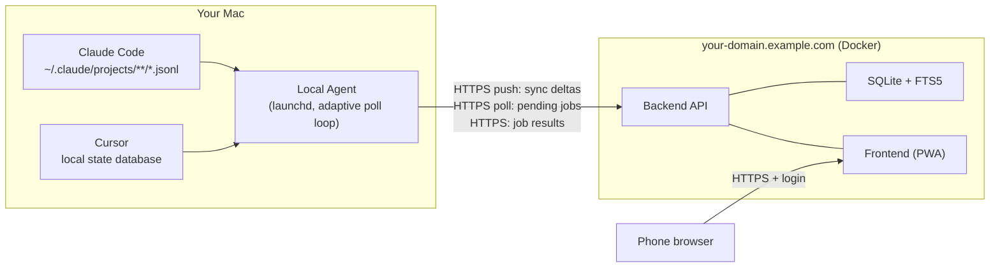

# AI Remote — Overview

> Your AI coding sessions, in your pocket.

This is the text companion to [`AI-Remote-Overview.pdf`](AI-Remote-Overview.pdf), a shareable 13-page product overview and installation guide. For the authoritative, always-current details see the [README](../README.md), [SECURITY.md](../SECURITY.md) and [agent/README.md](../agent/README.md).

## Contents

1. [What is AI Remote?](#1-what-is-ai-remote)
2. [How it works](#2-how-it-works)
3. [Features](#3-features)
4. [Security](#4-security)
5. [Installation](#5-installation)
6. [Enabling remote commands](#6-enabling-remote-commands)
7. [Configuration reference](#7-configuration-reference)
8. [Under the hood](#8-under-the-hood)

---

## 1. What is AI Remote?

AI Remote is a small, self-hosted web app that mirrors the chat history of [Claude Code](https://docs.claude.com/en/docs/claude-code) and [Cursor](https://cursor.com) from your Mac to your phone, and lets you send follow-up prompts back.

AI coding agents do long-running work. You start them at your desk and then walk away. AI Remote lets you check what the agent did, read the full conversation, and nudge it forward with a new prompt from a mobile browser.

| Part | What it is |
|---|---|
| **Local agent** | Python process on your Mac (a `launchd` service). Reads local chat files, uploads changes, executes jobs queued from the phone. |
| **Backend** | FastAPI service in Docker with SQLite + FTS5. Stores the chat index, message cache and job queue; serves the web UI. |
| **Phone UI** | Server-rendered web app, installable as a PWA. Search, filter, read, copy and send prompts to an allow-listed project. |

**Who it is for:** developers who run Claude Code or Cursor on a Mac, are comfortable running a small Docker service, and are willing to read a security model before exposing it.

**Who it is not for:** teams (one user, one shared API key, no tenant isolation) and anyone who needs a hardened zero-trust remote-execution service. See [Security](#4-security).

## 2. How it works



The Mac never accepts incoming connections. The agent reaches out to the backend, and the phone talks only to the backend.

### Sync cycle

Each cycle the agent:

1. **Scans** Claude Code and Cursor session files and works out which sessions changed.
2. **Pushes** only the deltas to the backend.
3. **Polls** the backend for pending jobs.
4. **Executes** each job and **reports** the result. The next cycle picks up the new content.

### Adaptive polling

The backend tells the agent how often to poll: every **60 s** when idle, and every **10 s** for **5 minutes** after any authenticated request from the phone (sending a command, loading history, navigating, filtering). A header indicator shows the current mode.

### Life of a remote command

1. The phone sends a prompt (session cookie). The backend runs **allow-list check #1** and queues the job.
2. The agent polls and receives the job.
3. The agent runs **allow-list check #2** and the **permission-profile check**, then invokes `claude` or `cursor-agent` (30-minute timeout).
4. The agent reports the result and any new messages.
5. The UI shows the status, then the result.

Resumed sessions run `claude -p --resume <id>` or `cursor-agent --resume <id> -p`; new sessions start a fresh headless run in the chosen project. A job that exceeds the timeout is killed and reported as `failed`.

## 3. Features

**Read and search**

- Browse all local Claude Code and Cursor sessions in one list.
- Filter by project path (with autocomplete), tool and date group; sort by date, title or path.
- Full-text search across sessions (SQLite FTS5).
- Formatted detail view: Markdown, tables, syntax-highlighted code, clickable paths.
- Load more or load the full history on demand, with an ETA countdown.
- Per-message copy button with rich-text clipboard support.
- English and German UI; light and dark theme; a Settings page for language, theme, sync intervals, kill switch and logout.
- Mobile-first layout with a bottom tab bar; installable as a PWA ("Add to Home Screen") with its own icon.

**Control**

- Continue an existing session by sending a follow-up prompt.
- Start a new session in an allow-listed project.
- Optional voice-input button for dictating prompts.
- Job status tracking from queued to running to done or failed.

**Operate safely**

- **Pause remote commands** kill switch: stops new jobs without affecting read-only sync.
- **Audit log** at `/jobs`: every job ever created, with type, target, prompt, status and result.
- "Last reachable" indicator for the Mac.

| Capability | Claude Code | Cursor | Notes |
|---|---|---|---|
| Read and search history | Yes | Yes | Read-only |
| Continue a session remotely | Yes | Yes | Allow-listed projects with a valid permission profile only |
| Start a new session remotely | Yes | Yes | Same restrictions |

## 4. Security

> **The sharp edge, stated plainly.** Anyone who holds the `API_KEY` can run AI-agent commands on your Mac, as your OS user, in auto-approving mode, inside your allow-listed projects. A leaked key exposes everything that user can reach. Treat `API_KEY` like an SSH private key.

AI Remote has a deliberately small threat model and layers several independent controls:

| Layer | Controls |
|---|---|
| 1. Network | TLS reverse proxy, loopback bind by default, no inbound connection to the Mac |
| 2. Identity | ≥32-character keys, signed session cookie bound to the API key, `/logout`, login throttling |
| 3. Scope | Allow-list checked twice (backend and agent), not editable via any API, fails closed |
| 4. Permissions | Per-project permission profile, dialect-validated, job refused if missing |
| 5. Control | Kill switch, 30-minute timeout, 32,000-character prompt cap |
| 6. Audit | Every job logged with prompt and result |

- **Outbound-only agent:** the Mac opens no listening port.
- **Strong secrets, enforced:** `API_KEY` and `SECRET_KEY` must be ≥32 characters or the backend refuses to start. Key comparison is constant-time.
- **Loopback by default:** `docker-compose.yml` binds `127.0.0.1`. Exposure beyond localhost needs a TLS-terminating reverse proxy and `SESSION_COOKIE_HTTPS_ONLY=true`.
- **Login rate-limiting:** per client bucket with bounded memory. Deliberately no global lockout, so an attacker cannot lock you out from elsewhere.
- **Dual allow-list:** `AI_REMOTE_ALLOWED_PROJECTS` is set and checked independently on both sides. Empty means remote execution is off.
- **Enforced permission profiles:** missing, empty, unparseable or wrong-dialect profiles make the job fail before the CLI runs.
- **Sanitised rendering:** chat content is rendered from Markdown through an HTML allow-list sanitiser (`bleach`).
- **Quiet by default:** `/docs` and `/openapi.json` are off unless `ENABLE_API_DOCS=true`.
- **Audited pre-release:** a pre-release audit found 0 Critical and 3 High issues, all in the remote-execution chain. All three are fixed, along with several Medium and Low findings.

### Known limitations

Documented in [SECURITY.md](../SECURITY.md); left unfixed because fixing them would mean a design change out of proportion to a single-user tool.

| Limitation | What to do |
|---|---|
| One secret serves two roles; sessions are stateless (14-day cookie, no per-session server-side revocation) | `/logout` ends your session; rotating `API_KEY` or `SECRET_KEY` invalidates all sessions. Don't let a browser remember the key. |
| No CSRF tokens (relies on `SameSite=Lax`) | Don't add a CORS policy or host untrusted content on sibling subdomains. |
| Permission profiles are deny-lists; templates are not exhaustive | Replace `allow` with a narrow explicit set per project. |
| Job history grows without bound | Back up and prune `data/app.db` yourself. |
| Login lock-out possible behind a proxy until configured | Set `TRUSTED_PROXY_HOPS` and `TRUSTED_PROXIES` together; keep the container reachable only via the proxy. |
| Dependencies are hash-pinned but not auto-audited | 7-day release cooldown in `relock.sh` and Dependabot; run `scripts/audit-deps.py` before releases and review Dependabot PRs. |
| Container runs as root | Add a non-root `USER` and re-own the volume. |
| Reference deploy script SSHes as `root` | Deploy with a dedicated, minimally-privileged user. |

### Hardening checklist

1. Generate both secrets with `./generate-secrets.sh` (never prints them; `--rotate` to replace).
2. Keep the backend on loopback behind a TLS reverse proxy.
3. Allow-list the smallest set of projects and read every permission profile line by line.
4. Rotate both secrets if either was ever printed, pasted into a chat, or captured in a transcript.

**Reporting a vulnerability:** open an issue on the project repository, or contact the maintainer directly for anything sensitive. Please don't publish exploit details before a fix exists.

## 5. Installation

**Prerequisites:** macOS with Python 3 and `openssl`; Claude Code and/or Cursor with some chat history; Docker with Compose; for internet access, a domain and a TLS-terminating reverse proxy (Nginx, Caddy, Plesk, …).

### A. Quickstart (local)

```bash
git clone https://github.com/janloeffler/ai-remote.git
cd ai-remote
./run.sh
```

On first run `run.sh` creates `.env` from `example.env` with generated secrets, starts the backend with Docker Compose, and runs one agent sync cycle so your sessions appear immediately. It prints the login URL and the first characters of your API key; the full value is in `.env`. Re-running is safe.

Open the printed URL and log in with the `API_KEY` from `.env`. To keep syncing in the background:

```bash
./setup-agent.sh              # install the launchd service
./setup-agent.sh --uninstall  # remove it
```

Logs: `~/Library/Logs/ai-remote-agent.log`.

### B. Deploy for phone access

1. Configure `.env`:

   ```bash
   AI_REMOTE_BACKEND_URL=https://your-domain.example.com
   SESSION_COOKIE_HTTPS_ONLY=true
   SSH_HOST=user@your-server.example.com   # for the SCP deploy path
   ```

2. Pick a deploy path:

   | Script | How it works |
   |---|---|
   | `deploy-production-scp.sh` | Builds the image, ships it over SCP (no registry), restarts via SSH. Needs `SSH_HOST` and passwordless SSH. |
   | `build-and-push.sh` | Builds and pushes to `REGISTRY` (e.g. `ghcr.io/<your-username>`); deploy however your platform expects. |
   | `deploy-to-plesk.sh` | The author's own Plesk Docker flow (SSH + `docker load`). Needs `PLESK_HOST`. |

3. Terminate TLS in front of the container (port 8000). Behind a reverse proxy, set `TRUSTED_PROXY_HOPS` and `TRUSTED_PROXIES` **together**.
4. Point the agent at the public URL:

   ```bash
   ./setup-agent.sh --backend-url=https://your-domain.example.com
   ```

5. On your phone, open the URL, log in, and use Safari's **Share → Add to Home Screen**.

## 6. Enabling remote commands

Reading history works out of the box. Sending prompts is **off** until you configure two things per project.

**1. Allow-list the project path, on both sides.** Set absolute, symlink-resolved paths in the repo-root `.env`, then re-run `./setup-agent.sh`. The backend reads the same variable from its own `.env` on the server. The two copies are never synced.

```bash
AI_REMOTE_ALLOWED_PROJECTS=/Users/you/projects/my-app,/Users/you/projects/other-app
# canonical form:  cd <dir> && pwd -P
```

**2. Give each project a permission profile in the right dialect.**

| Tool | File | Rule types |
|---|---|---|
| Claude Code | `<project>/.claude/settings.json` | `Bash(...)`, `Edit(...)`, `Read(...)`, `Write(...)`, `WebFetch(...)` |
| Cursor | `<project>/.cursor/cli.json` | `Shell(...)`, `Read(...)`, `Write(...)`, `WebFetch(...)`, `Mcp(...)` |

Starter templates are in [`docs/superpowers/reference/`](superpowers/reference/). Example for Claude Code:

```json
{
  "permissions": {
    "allow": ["Read(**)", "Edit(**)", "Bash(pytest:*)"],
    "deny": ["Bash(git push:*)", "Bash(rm -rf:*)", "Bash(sudo:*)", "Bash(curl:*)", "Bash(wget:*)"]
  }
}
```

**3. Restart and test** with a harmless read-only prompt; check the result at `/jobs`.

> **Why the dialect matters.** Cursor has no `Bash(...)` and Claude Code has no `Shell(...)`. Because `cursor-agent --force` allows everything not explicitly denied, a Claude-style profile pasted into `.cursor/cli.json` would deny nothing while looking configured. AI Remote rejects wrong-dialect profiles and fails the job instead. The shipped templates are starting points: replace broad `Read(**)` / `Edit(**)` grants with the smallest set each project needs.

To disable remote execution entirely, leave `AI_REMOTE_ALLOWED_PROJECTS` empty. The app then works as a read-only history viewer.

## 7. Configuration reference

All settings live in one repo-root `.env` (copy `example.env`).

| Variable | Default | Purpose |
|---|---|---|
| `API_KEY` | *required, ≥32* | Shared secret: agent bearer token and login password. |
| `SECRET_KEY` | *required, ≥32* | Signs the browser session cookie. |
| `PORT` | `8000` | Local port bound on loopback. |
| `DATABASE_PATH` | `app.db` | SQLite file location. |
| `SESSION_COOKIE_HTTPS_ONLY` | `true` | Marks the cookie `Secure`. `run.sh` sets `false` for local http. |
| `LOCAL_HOME_DIR` | `/Users/yourname` | Your Mac's home directory, for `~` expansion in the path filter. |
| `CHAT_HISTORY_PAGE_SIZE` | `10` | Messages per "load more" click. |
| `AI_REMOTE_BACKEND_URL` | — | Where the agent sends sync and job requests. |
| `AI_REMOTE_INTERVAL_SECONDS` | `60` | Default (idle) poll interval. Overridable under Settings. |
| `AI_REMOTE_ACTIVE_INTERVAL_SECONDS` | `10` | Poll interval during an active window. Overridable under Settings. |
| `ACTIVE_INTERVAL_DURATION_MIN` | `5` | Length of an active window after phone activity. |
| `AI_REMOTE_ALLOWED_PROJECTS` | empty = off | Comma-separated absolute paths where remote commands may run. Must match on both sides. |
| `TRUSTED_PROXY_HOPS` / `TRUSTED_PROXIES` | `0` / empty | Trusted reverse-proxy config for login throttling. Set together. |
| `ENABLE_API_DOCS` | `false` | Serve `/docs` and `/openapi.json`. |
| `AI_REMOTE_AGENT_LABEL` | `com.example.ai-remote-agent` | `launchd` service label. |
| `REGISTRY` | — | Container registry for `build-and-push.sh`. |
| `SSH_HOST` / `SSH_PATH` | — / `/opt/ai-remote-backend` | Target for the SCP deploy. |
| `PLESK_HOST` | — | SSH target for the Plesk deploy path. |

## 8. Under the hood

- **Backend:** Python 3.12, FastAPI, Uvicorn, Jinja2, SQLite with FTS5, `markdown` + `pygments` + `bleach`, `itsdangerous` signed cookies; packaged as a Docker image.
- **Agent:** plain Python with a single dependency (`httpx`); reads Claude Code `.jsonl` transcripts and Cursor's local state; runs as a launchd user service.

```
backend/    FastAPI app: auth, chat list/detail/search, job queue, SQLite + FTS5
agent/      Local polling agent: session scanning, command execution, permission checks
docs/       Design specs and implementation plans for every feature
*.sh        run, agent install/update, and deploy scripts
```

```bash
./run.sh --test               # both test suites from the repo root
cd backend && .venv/bin/pytest -v
cd agent   && .venv/bin/pytest -v
```

### Where contributions help most

- **More languages:** the UI ships in English and German (`backend/app/i18n.py`); further locales are a single dictionary each.
- **Hardening items from [SECURITY.md](../SECURITY.md):** non-root container, per-session revocation, CSRF tokens, job retention, running the dependency audit in CI.
- **More tools and platforms:** additional agent CLIs, Linux and Windows agent services.
- **Docs and deploy recipes:** reverse-proxy examples, Compose-with-proxy templates.

### FAQ

**Does my chat history leave my network?** It is uploaded to *your* backend, which you host. No third-party service is involved, but the backend stores chat content in plain SQLite, so protect the server and the `data/` volume.

**Can it modify my existing sessions?** Syncing is read-only. Remote prompts are executed by the official `claude` / `cursor-agent` CLIs, which then write to their own session files as usual.

**What if my phone is lost?** Rotate `API_KEY` (and `SECRET_KEY`) and redeploy; rotating either invalidates every existing session. Use the kill switch first if you can still reach the UI.

---

AI Remote is an independent project and is not affiliated with or endorsed by Anthropic or Anysphere. Claude Code and Cursor are trademarks of their respective owners. Licensed under the [MIT License](../LICENSE).
