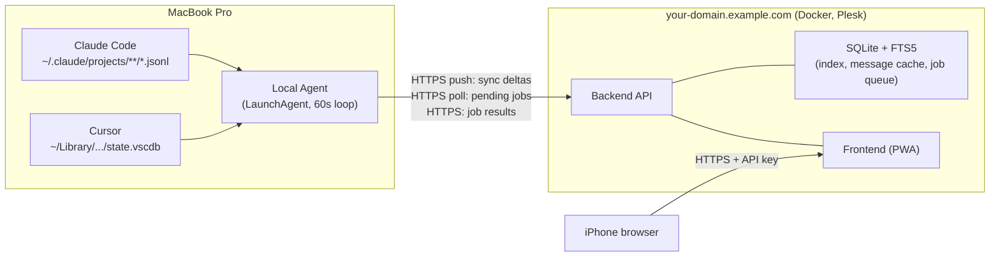

# AI Remote Chat Viewer — Design

**Date:** 2026-08-04
**Status:** Approved for planning

## Overview

A personal, single-user web app that lets Jan browse his Claude Code (CLI +
VS Code extension) and Cursor chat history from his iPhone, and optionally
send follow-up commands back to a local agent running on his MacBook Pro.
Runs at `https://your-domain.example.com`.

## Goals

- Read-only remote access to all local Claude Code + Cursor chat sessions:
  list, group/filter (creation date, last response, tool, project), full-text
  search, formatted detail view (last message by default, full history on
  demand).
- Power feature: send a command from the web app back to the Mac — either
  continue an existing session or start a new one in an allow-listed project.
- Secure single-user access via API key, reachable from anywhere (no VPN
  required).

## Non-Goals

- Multi-user / multi-tenant support.
- Editing or deleting chat history.
- Real-time (<1s) sync — a ~60s round-trip in either direction is acceptable.
- Full desktop-GUI parity for Cursor (e.g. guaranteeing a `cursor-agent`
  turn is visible inside Cursor's own GUI — see Known Limitations).
- Automated browser E2E test suite — this is a solo-use tool; manual smoke
  testing is proportionate.

## Architecture

Everything runs on a 60-second cycle on the Mac side: scan for changed
sessions → push deltas → poll for pending jobs → execute any job → push the
result → next cycle picks up the new content.

## Components

### 1. Local Agent (macOS, LaunchAgent)

- **Indexer** — scans `~/.claude/projects/<project>/<session>.jsonl` (top-level
  session files only — `subagents/agent-*.jsonl` sidechains are intentionally
  excluded, since they're internal steps of the main session, not something
  the user browses or resumes as a chat in their own right) and Cursor's
  global `state.vscdb` (`composerHeaders` table + `cursorDiskKV` for
  `composerData:*` / `bubbleId:*`). Extracts per-session metadata: tool,
  entrypoint (cli / vscode-extension), project path, title (first prompt or
  `ai-title` event), created/updated timestamps, message count, last-message
  preview.
- **Delta detection** — keeps a local, on-disk cursor per source (last-seen
  mtime for Claude Code files, last-seen `recency`/`lastUpdatedAt` for Cursor
  composers). Each cycle only processes sessions newer than the cursor —
  necessary given Cursor's global DB has been observed at 15GB+.
- **Uploader** — pushes new/changed session headers + last-message preview to
  the backend over HTTPS with the API key. Full message content is *not*
  pushed proactively (see Sync Mechanics).
- **Command executor** — polls the backend for pending jobs; runs
  `claude -p --resume <id> "<prompt>"` (cwd = session's project path) or
  `claude -p "<prompt>"` with cwd set to an allow-listed project for new
  sessions; analogous `cursor-agent --resume <id> -p "<prompt>"` /
  `cursor-agent -p --workspace <path> "<prompt>"` for Cursor. Captures
  stdout/stderr/exit code and reports the result back. See Security &
  Guardrails for the permission configuration.
- Runs continuously via `launchd` with `KeepAlive`, so a crash restarts it;
  the on-disk sync cursor means a restart never reprocesses everything or
  loses track of pending work.

### 2. Backend API (Docker container on `your-domain.example.com`)

- Single deployable container: API server + SQLite database (mounted as a
  Docker volume for persistence across container restarts) + serves the
  built frontend.
- Auth: every request requires a Bearer API key (single static, rotatable
  secret) checked in middleware. TLS terminated by Plesk in front of the
  container.
- Storage: SQLite with an FTS5 virtual table for full-text search.
- Endpoints (indicative, not final):
  - `POST /sync/index` — agent pushes session header/preview deltas
  - `GET /chats` — list with filter/group query params
  - `GET /chats/:id` — detail, including cached messages if fetched
  - `POST /chats/:id/fetch-full` — creates a `fetch_full` job
  - `POST /chats/:id/command` — creates a `resume_message` job
  - `POST /projects/:path/command` — creates a `new_session` job
  - `GET /jobs/pending` — agent polls this
  - `POST /jobs/:id/result` — agent reports job completion
  - `GET /search?q=` — full-text search

### 3. Frontend (responsive web app, installable as a PWA)

- **List view** — cards with tool icon, project, title, last-message
  preview, timestamp, active/idle badge. Group/filter by creation date, last
  response, tool, and project (used as the practical stand-in for "topic" —
  no NLP topic extraction).
- **Search** — single search box over titles, previews, and any
  fully-loaded message content; combinable with filters.
- **Detail view** — chat-bubble rendering of Markdown content with
  syntax-highlighted code blocks; shows the last message by default, with a
  "Load full history" button that triggers a `fetch_full` job.
- **Command composer** — on a chat detail page, a text field to continue
  that session; a separate "New session" screen listing only allow-listed
  projects, with a text field to start a new one. Job status
  (pending/running/done/failed) is polled at a short interval while the
  screen is open — this polling is only between the browser and the
  backend, independent of the 60s Mac-side cycle.
- **PWA** — manifest + service worker for "Add to Home Screen" and caching
  the last-seen list for a basic offline shell. Not a full offline mode.

## Data Model

| Entity | Fields | Notes |
|---|---|---|
| **Session** | id, tool, entrypoint, project_path, title, created_at, last_updated_at, message_count, last_message_preview, full_content_synced, status | `status` (active/idle) derived from `~/.claude/ide/*.lock` presence + mtime recency; best-effort, not authoritative |
| **Message** | session_id, index, role, timestamp, content | Only populated once a session has had a `fetch_full` job run |
| **Job** | id, type (resume_message \| new_session \| fetch_full), target, payload, status, result_text, created_at, completed_at | Queue table; agent polls and updates |
| *Sync cursor* | source, last_seen_marker | Lives only on the Mac (local agent state), never in the backend |

## Sync Mechanics

- Each 60s cycle pushes only headers + last-message preview for
  new/changed sessions — small payloads regardless of Cursor DB size.
- Full transcripts are loaded lazily: opening "Load full history" (or an
  explicit refresh) creates a `fetch_full` job; the agent reads the complete
  transcript/composer data and uploads all messages, after which that
  session is cached and fully searchable until it changes again.
- **Consequence for search**: sessions never opened remain searchable only
  by title/last-message preview, not by their full content. Accepted
  trade-off in exchange for a fast, lightweight initial sync (chosen over
  a full upfront content sync, which would be materially heavier given
  Cursor's multi-GB local store).

## Command / Job Flow

1. User submits a command in the web app → backend validates the target
   (existing session id, or project path against the allow-list) → creates
   a `pending` job.
2. Next agent poll picks it up, marks it `running`, executes the
   appropriate CLI invocation (see Security & Guardrails for exact
   permission flags).
3. Agent reports `done` (with result_text) or `failed` (with captured
   stderr) back to the backend.
4. The following sync cycle picks up the new/updated session content
   naturally — no separate "refresh" step needed.
5. Backend force-fails any job stuck in `running` past a timeout (agent
   crash mid-execution), so the UI never shows "running" forever.

## Security & Guardrails

- **Project allow-list** lives only in the local agent's config file on the
  Mac — never editable via the API or the app. Both the backend (at job
  creation) and the agent (at execution) validate the target project path
  against this list — defense in depth.
- **Claude Code**: executed with `--permission-mode dontAsk` plus a
  pre-defined `permissions.allow` rule set in `settings.json` (local only)
  — e.g. file edit/read and test-running within allow-listed projects, but
  no `git push`, `rm -rf`, sudo, or arbitrary network access.
  `--dangerously-skip-permissions` is explicitly not used — Anthropic's own
  docs restrict it to isolated, network-less containers, which doesn't
  match "runs on my actual Mac".
- **Cursor**: `cursor-agent` (currently a beta CLI) has no comparably
  granular allow-list mechanism — only coarse `--force`/`--yolo`/`--trust`
  flags. The only real scoping available is `--workspace <allow-listed
  path>`. **Known accepted limitation**: Cursor-originated remote commands
  carry materially weaker guardrails than Claude Code ones.
- **Audit log**: every executed job (command, target, result, exit code) is
  stored and visible in the app — full traceability of anything triggered
  remotely.
- **Kill switch**: an in-app "pause remote commands" toggle for routine use
  (agent checks this flag before executing any job). The actual emergency
  stop for a suspected compromised API key is local-only (stop the agent /
  rotate the key on the server) — a purely remote-reachable kill switch
  would be useless in an actual compromise scenario.

## Deployment

- Single Docker image (backend + built frontend), deployed via Plesk's
  Docker support, bound to the subdomain
  `your-domain.example.com` with Plesk-managed TLS.
- SQLite database file lives on a mounted host volume so it survives
  container recreation/updates.
- Local agent installed as a `launchd` LaunchAgent on the MacBook Pro,
  configured with: backend URL, API key, and the project allow-list.

## Error Handling

- **Agent**: sync pushes retry with backoff, leaving the local cursor
  unchanged on failure (no data loss, no gaps); `SQLITE_BUSY` on the Cursor
  DB triggers a brief retry, then the cycle is skipped and retried next
  time; command failures (non-zero exit, timeout) are never swallowed —
  always recorded as a `failed` job with captured stderr.
- **Backend**: `401` on missing/invalid API key; job creation outside the
  allow-list is rejected even though the agent double-checks; jobs stuck in
  `running` past a timeout are force-failed.
- **Frontend**: shows "Mac last seen X minutes ago" (derived from the last
  successful agent check-in) instead of implying live data; failed commands
  show the error text with a retry button that creates a fresh job.

## Testing Strategy

- **Indexer**: unit tests against fixture `.jsonl` files and a sample SQLite
  DB matching Cursor's real schema — verifies delta detection and parsing.
- **Command executor**: tested against a stub CLI (not the real
  `claude`/`cursor-agent` binaries) to verify job status transitions and
  allow-list enforcement.
- **Backend**: API tests against an ephemeral SQLite DB — auth checks, FTS5
  search behavior, job lifecycle.
- **Manual end-to-end smoke test** before calling the MVP done: real sync of
  a small test project, one "continue chat" command and one "new session"
  command, confirming both show up correctly in the app after the next
  cycle. A full automated browser E2E suite is not warranted for a
  single-user personal tool.

## Known Limitations / Open Risks

- **Cursor GUI continuity is unconfirmed**: it's not officially documented
  whether a turn injected via `cursor-agent --resume` appears in Cursor's
  own GUI chat history (an open Cursor feature request suggests CLI and GUI
  chat storage may not be unified yet). This app doesn't depend on that —
  all viewing happens through this app's own UI — but "pick up exactly
  where you left off inside Cursor itself" may not work reliably.
- **Weaker Cursor guardrails**: see Security & Guardrails — accepted for
  v1.
- **Mac must be awake and online** for both sync and commands to make
  progress; while asleep/offline, the app still shows the last-synced state
  (with a staleness indicator) but nothing new arrives until it wakes up.
- **Storage/format fragility**: Cursor's local chat storage schema has
  changed materially across versions (workspace-scoped → global) and
  Anthropic explicitly calls the Claude Code `.jsonl` format internal/
  unstable — both indexers should be treated as needing occasional
  maintenance as these tools update.

## Assumptions

- Single Mac, single user, personal use only.
- The user already has `your-domain.example.com` (Plesk, Docker-capable) and will
  create the `ai-remote` subdomain.
- API key is a single static secret entered once in the browser and stored
  client-side; rotation is a manual, server-side action.
