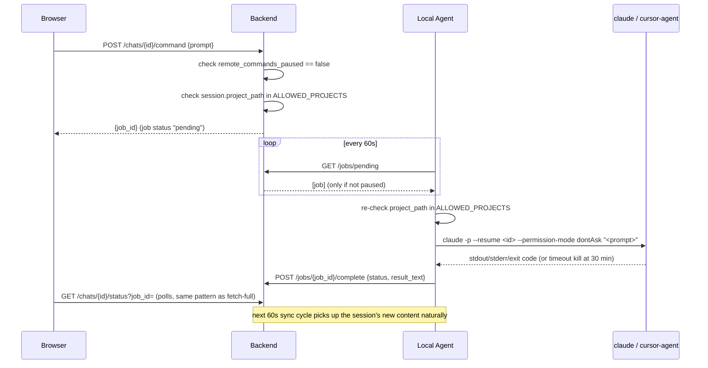

# Remote Command Execution ("Plan B") — Design

**Date:** 2026-08-06
**Status:** Approved for planning
**Builds on:** `docs/superpowers/specs/2026-08-04-ai-remote-chat-viewer-design.md` (Plan A,
merged) and `docs/superpowers/specs/2026-08-05-frontend-polish-design.md` (merged). Plan A's
implementation plan explicitly deferred this: "Plan B (remote commands / job execution beyond
`fetch_full`) builds on top of this later."

## Overview

Plan A shipped a read-only remote viewer. This adds the "power feature" the original design
doc always intended: sending a command from the web app back to the Mac — either continuing an
existing Claude Code/Cursor chat session with a follow-up prompt, or starting a brand-new
session in an allow-listed project. The `jobs` table already reserves `resume_message` and
`new_session` as valid `type` values (added in Plan A's schema, unused until now); this plan
implements both.

## Goals

- From the chat detail page, send a follow-up prompt that resumes that exact session on the Mac
  (`resume_message`).
- From a new "Neue Session" screen, start a brand-new session in one of a small, explicitly
  allow-listed set of project folders (`new_session`).
- Defense-in-depth allow-list enforcement: both the backend (at job creation) and the agent (at
  execution) independently validate the target project path, from two independently-configured
  copies of the same env var — neither editable via the API.
- A site-wide "pause remote commands" kill switch and a visible audit log of every executed
  command (target, prompt, result, exit status) — both called for in the original design doc's
  Security & Guardrails section, neither implemented until now.
- Guardrails appropriate to each tool: Claude Code via `--permission-mode dontAsk` plus a
  curated `permissions.allow`/`deny` profile (never `--dangerously-skip-permissions`); Cursor via
  `--force`/`--workspace` (its ceiling — no comparably granular allow-list mechanism exists).

## Non-Goals

- No editing/deleting chat history (unchanged from Plan A).
- No automatic drift detection between the backend's and agent's independently-configured
  allow-list env vars — see Known Limitations.
- No agent-side "check a pause flag before running" logic — the kill switch works by the backend
  never handing a paused-out job to the agent in the first place (see Kill Switch).
- No automatic writing of `permissions.allow`/`deny` profiles into allow-listed projects — the
  agent never silently modifies a project's `.claude/settings.json`; a starter profile is
  documented for you to place there yourself.
- No filters/search on the audit log for v1 (YAGNI until it's actually long enough to need them).
- No full automated browser E2E suite (unchanged from Plan A) — manual smoke test only.

## Architecture

Unchanged from Plan A's 60-second poll loop. The agent's poll of `GET /jobs/pending` now may
also receive `resume_message`/`new_session` jobs alongside `fetch_full`; the same "push
deltas → poll jobs → execute → report → next cycle picks up new content" cycle applies, since a
successfully executed command just produces a normal (or updated) session that the regular
sync indexer discovers on its next pass — no separate "refresh" mechanism needed.

## Data Model

| Change | Detail |
|---|---|
| `jobs.type` | No migration — `resume_message`/`new_session` already valid per Plan A's `CHECK` constraint. |
| `jobs.payload` | Reused (already free-text JSON): `{"prompt": "..."}` for `resume_message`; `{"prompt": "...", "tool": "claude-code"\|"cursor"}` for `new_session`. |
| `jobs.target` | `resume_message`: existing session id (`"claude-code:<id>"` / `"cursor:<id>"`). `new_session`: the raw allow-listed project path. |
| New `settings` table | Singleton row (mirrors the existing `agent_status` singleton pattern): `remote_commands_paused INTEGER NOT NULL DEFAULT 0`. |
| Env var (new, two copies) | `AI_REMOTE_ALLOWED_PROJECTS` — comma-separated absolute paths. Set independently in the backend's `.env` (server) and the agent's `.env` (Mac). Neither is ever exposed or settable via any API route. |

## Command / Job Flow

### Continue an existing session (`resume_message`)

1. Chat detail page shows a "Befehl senden" composer **only** if that session's `project_path`
   is in the backend's allow-list (hidden otherwise — no dead-end compose-then-403).
2. `POST /chats/{id}/command {prompt}` → backend validates: session exists (404 if not),
   `remote_commands_paused` is off, `project_path` is in `AI_REMOTE_ALLOWED_PROJECTS` (exact
   match, not prefix/substring — an allow-listed `/Users/jan/source/foo` must never match
   `/Users/jan/source/foo-evil`). Creates a `resume_message` job, returns `{job_id}`.
3. Next agent poll that isn't paused claims it; the agent re-validates `project_path` (looked up
   fresh from its own state/session source, since the job only carries a session id) against
   its own `AI_REMOTE_ALLOWED_PROJECTS`. On failure: report `failed` immediately, no subprocess
   spawned.
4. Agent runs `claude -p --resume <id> --permission-mode dontAsk "<prompt>"` (cwd=project path)
   or `cursor-agent --resume <id> -p --force --workspace <project_path> "<prompt>"`, subprocess
   wrapped with a 30-minute timeout (kill the whole process group on expiry, not just the
   parent — avoids an orphaned CLI process outliving the job).
5. Agent reports `done`/`failed` with captured stdout/stderr (tail, truncated for storage).
6. UI polls `/chats/{id}/status?job_id=` — identical mechanism to the existing "Mehr laden"
   button's polling in `app.js`. On `done`, the page reloads; on `failed`, `result_text` is shown
   inline in the composer with a retry option (re-submits the same prompt as a fresh job).
7. The following regular sync cycle picks up the session's new messages naturally.

### Start a new session (`new_session`)

1. "Neue Session" nav entry → `GET /projects/new`: lists the backend's
   `AI_REMOTE_ALLOWED_PROJECTS` paths (deliberately *not* `get_distinct_project_paths`, which
   includes every project ever synced — most aren't allow-listed) with a tool selector
   (`claude-code`/`cursor`) and a prompt textarea per project.
2. `POST /projects/command {project_path, tool, prompt}` → same paused-check and exact-match
   allow-list validation as above (an allow-listed path with zero prior sessions must still
   work — validation is against the allow-list, never against existing `sessions` rows).
3. Creates a `new_session` job (`target=project_path`), returns `{job_id}`.
4. Agent re-validates, then runs `claude -p --permission-mode dontAsk "<prompt>"` (cwd=
   project_path) or `cursor-agent -p --force --workspace <project_path> "<prompt>"`. Captures the
   new session id from CLI output on a best-effort basis for the audit log/result text — parsing
   failure isn't fatal, since the next sync cycle discovers the new session file/composer
   regardless.
5. Since there's no existing chat page to redirect to, the composer shows "Fertig — die neue
   Session erscheint in der Liste" (or the failure text) rather than a deep link.

## Kill Switch

The backend is the sole enforcement point. `remote_commands_paused` (toggled via
`POST /settings/pause-remote-commands`, a switch in the list page's toolbar) is checked inside
`claim_pending_jobs`' filtering: while paused, `GET /jobs/pending` excludes `resume_message` and
`new_session` jobs from what it returns — they remain `pending` in the DB — while `fetch_full`
(read-only) keeps flowing unaffected. No agent-side "check a flag" logic exists or is needed: a
command job the agent never received can't be executed. A site-wide banner ("Remote-Befehle
pausiert") renders whenever the flag is on, visible from any page, not just the toggle itself.

## Job Timeout

`fail_stale_jobs` (existing, currently a single 300s cutoff for all types) gets a per-type
timeout: 300s (unchanged) for `fetch_full`, 1800s (30 min) for `resume_message`/`new_session`.
This backend-side cutoff is bookkeeping only — it marks the DB row `failed` but cannot kill a
process running on the Mac. The real enforcement is the agent's own subprocess timeout (also
1800s, process-group kill on expiry) — keeping both values equal avoids the backend marking a
job `failed` while the agent-side timeout would have let it run longer.

## Security & Guardrails

- **Allow-list, defense in depth:** two independently-configured `AI_REMOTE_ALLOWED_PROJECTS`
  env vars (backend's `.env` on the server, agent's `.env` on the Mac) — never editable via any
  API route, never synced between the two. Both sides do an exact-match check.
- **Claude Code:** `claude -p --resume <id> --permission-mode dontAsk "<prompt>"` (or without
  `--resume` for new sessions) — never `--dangerously-skip-permissions`. This relies on a
  `permissions.allow`/`deny` profile already present in each allow-listed project's
  `.claude/settings.json`. This plan ships a documented starter profile at
  `docs/superpowers/reference/remote-agent-permissions.settings.json` (`allow`: file read/edit,
  running the project's test command; `deny`: `git push`, recursive/force deletes, `sudo`,
  raw network tools) — you copy/merge it into each allow-listed project yourself; the agent never
  writes it there automatically.
- **Cursor:** `cursor-agent ... --force --workspace <path>` — the only real scoping Cursor's
  beta CLI offers (per Plan A's accepted limitation: materially weaker than Claude Code's).
- **Audit log:** `GET /jobs` lists every job ever created (all types), newest first — id, type,
  target, prompt (from `payload`), status, result_text, created_at/completed_at. Read-only.
- **Kill switch:** see above.

## Error Handling

- 403 (not allow-listed) and paused-state rejections render inline in the composer, not a raw
  error page — consistent with the existing "failed job → show error + retry" UX.
- Non-zero CLI exit or timeout → `status="failed"` with captured stderr (truncated) — never
  swallowed, shown in both the composer and the audit log.
- New-session validation is against the allow-list only, independent of whether any session has
  ever been synced from that path (a fresh allow-listed folder with zero chat history must still
  accept a "new session" command).

## Testing Strategy

- **Backend:** route tests for allow-list accept/exact-match-reject (including the
  prefix/substring trap case), paused-state rejection of `resume_message`/`new_session` job
  creation *and* of `jobs_pending` claiming, job payload/target shape for both job types,
  `/jobs` audit rendering, per-type timeout value in `fail_stale_jobs`.
- **Agent:** `execute_resume_message`/`execute_new_session` tested against a stub CLI script
  (not real `claude`/`cursor-agent`) verifying: correct command construction per tool, `cwd`,
  allow-list re-check short-circuits before spawning a subprocess, stderr capture on non-zero
  exit, process-group kill on timeout.
- **Manual end-to-end smoke test** (no automated browser E2E, per Plan A's established
  precedent): one real "continue chat" and one real "new session" command against a throwaway
  allow-listed test project, confirming the audit log and the next sync cycle both show correct
  results.

## Known Limitations

- Cursor guardrails remain structurally weaker than Claude Code's (carried over from Plan A —
  accepted).
- The backend's and agent's allow-list env vars are two independently-set copies with no
  automatic drift detection; if you update one and forget the other, the *stricter* side simply
  wins for its own check — no silent bypass, but no warning either. Acceptable for a
  single-operator personal tool; worth a one-line README callout.
- The starter `permissions.allow`/`deny` profile is a template, not a guarantee — its
  effectiveness depends on it actually being placed (and kept correct) in every allow-listed
  project's `.claude/settings.json`.

## Assumptions

- Single Mac, single user (unchanged from Plan A).
- You will place the starter `permissions.allow`/`deny` profile (or your own equivalent) into
  each allow-listed project before sending it a remote command — this plan documents the
  requirement and ships the template, but does not enforce its presence at runtime.
- `AI_REMOTE_ALLOWED_PROJECTS` is a short, deliberately curated list (a handful of projects you
  trust for unattended remote execution) — not the full ~150-path set already known from
  historical sync data.
